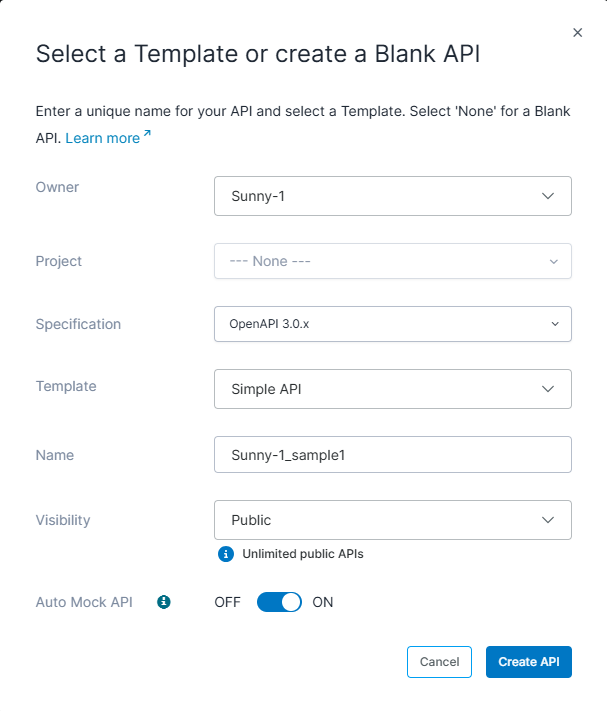
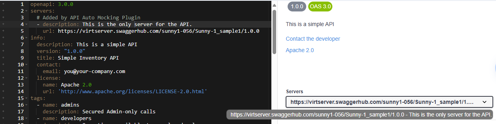
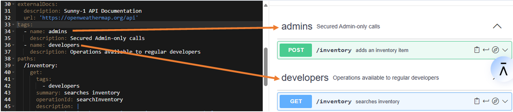
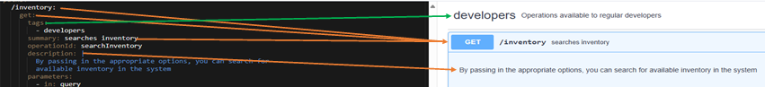
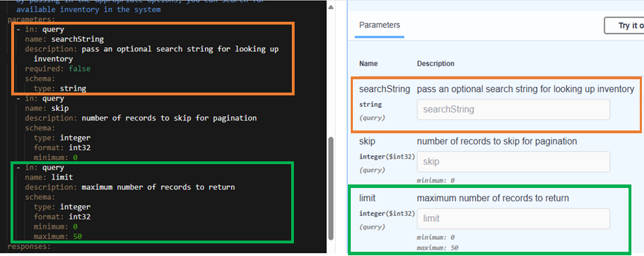
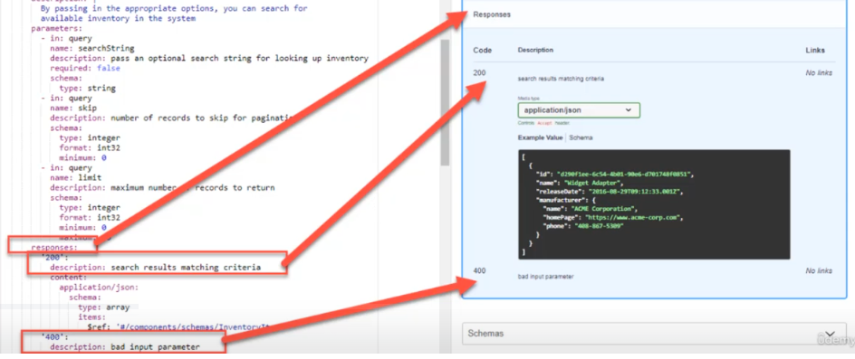

# Section 2 Using Swagger UI to Write API Documentation
[Swagger](https://swagger.io) is an API development platform that uses the capabilities of the open source Swagger framework as well as these additional API capabilities:
* Build
* Document
* Manage
* Deploy

https://app.swaggerhub.com/apis/JPDocu/JPDocu_sample1/1.0.0

## Benefits of using Swagger
Provides a write as you design approach:
* Create a new REST (representational state transfer) API
* Document while designing the REST API
* Tools are pre-defined so you don't need to write in JSON or YAML

## Create a New API
1. Log in to [Swagger](https://app.swaggerhub.com/sunny1-056/home/home). 
2. From the Home page, click **Create API**.
3. Specify the info shown below.

    
4. Click **Create API**. 

   The API will open for editing.
5. Click the back arrow to return to the Search page.
6. Click **My APIs** to see the new API listing. 
7. Click the API in the list to open it for editing.

## Create the API Introductory page

> [!Note]
> You can enter the information in the Code view or click **Form** to enter information via fields. The Form view includes additional fields, ones that are optional (I suspect) such as the name of the developer/API contact instead of just the email address as is shown by default in the Code view.  
The Form view has two tabs, API Overview and Info. Look closely at each tab because some of the info seems to overlap, i.e., info description field. Also, additional server and server descriptions are added to the code differently when you use the form. The url was listed before the desc which is opposite of the default server/desc info. I think it makes maore sense to list the desc first. 
1. Open the API for editing.
2. Ensure that the Preview is enabled. It will display on the right side of the screen.
3. Enter this information:

> [!Note]
> OpenAPI documents are usually YAML, which uses spaces, colons to denote an object’s properties and hyphens to denote an array. See [Working in YAML](https://idratherbewriting.com/learnapidoc/pubapis_yaml.html).

* ### Servers section

  _description_ and _url_: List a description and the URL for each server that hosts the API.    

   A REST API can be hosted on one or more servers. There might be a dev server, a sandbox server, a production server, etc.  
      
  

  If you enter info via the form, you can easily add variables for the server. 

  :interrobang: What are legit variables? Reasearch! 

* ### Info section 

  _description_: Specify the API summary info; include the intended use of the API and connection and authentication info. Also, provide a link to further documentation that is NOT part of the API doc, such as tutorials, user guides, etc.
  
  _title_: Update the title of the API if necessary

  _contact_: Specify who to contact for questions about API. This infor corresponds to the Contact the developer link as seen in the preview.

  _license: name_ and _url_: Specify the license that for the API and the url to the license. These values are used for the link as seen in the preview.. The license agreement is the legal contract that governs the use of APIs between the licensor and other developers or users who want to use the API.

  _Documentation: External Docs and Documentation URL_: In the course video ([Lesson 29 @ 3:57](https://www.udemy.com/course/technical-writing-how-to-write-api-software-documentation/learn/lecture/29897106#overview)), instructor shows documentation fields in the Form view but they are not available in my version of Swagger. After instructor (Jordan) adds doc via fields, I didn't see that it was displayed in the Code view.
  
  In [Idratherbewriting.com (IRBW)](https://idratherbewriting.com/learnapidoc/pubapis_openapi_step8_externaldocs_object.html), this code is used to add doc links:

  ```
  - externalDocs:
      description: API Documentation
      url: https://openweathermap.org/api
  ```

  The code does not fall under the Info object. The externalDocs object sits at the same level as Info, Server, and Tags. IRBW says the external doc should relate to API as a whole whereas the course instructor says to mention doc that is related but not specifically about API, like a user guide. Maybe two different types of doc references are used in the API doc, or maybe two different philosophies?? In the Swagger Editor Petstore example, the code above is used just below the license info which tacks with what Jordan mentions.

## Define tags
  Use this section to create metadata/tags that you will apply to the contents of the API. The tags relate to target audiences. Apply the tags to information within the API for well-structured and organized content. 

  

## Define API operations and paths
General steps
1. Define the operations (GET, SET, POST, DELETE, etc.) that the API supports. 
2. Define the path (endpoints) in the URL that access this part of the API (/path). So it would be the path (URL) to where the API is on a server, which was specified in the Servers section, plus the endpoint which points to the specific part of the API (inventory). For example, https://virtserver.swaggerhub.com/sunny1-056/Sunny-1_sample1/1.0.0/inventory.
3. Apply the tags, if appliacble, to use for path.
4. Write a summary and a detailed desc about the part of the API.
5. Describe the API request parameters. This includes all the required and optional infomation that must be contained in a request.
6. Describe the API responses.

### Steps 1-4 Operations, path, tags, and summary



### Step 5 Describe the API request parameters
Define these charateristics of each parameter of the API request:
1. How the parameter is received.
  :interrobang: Not sure what he means by this - schema?
2. Specify the parameter name and provide description.
3. Indicate if the parameter is mandatory (required: true) or optional (required: false). It appears that you only have to indicate when a parameter is optional. In the example below, the skip and limit parameters do not include _required_.
4. Define any additional properties.



> [!Note]
> If you click **Try it out** in the Preview, you can enter values in the fields and the click **Execute** to test the API.

### Step 6 Define the API responses
1. Define the responses that the API can return.
2. Define the response codes and error response codes that the API can return.



## Exporting API documentation
Click the **Share and Collaborate** icon to access the URL that points to your API documentation.


  


